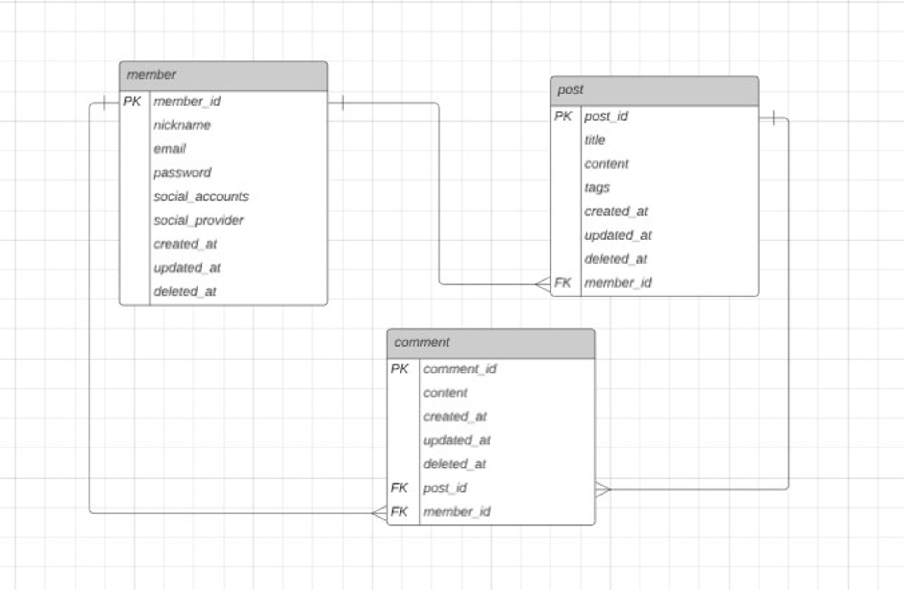
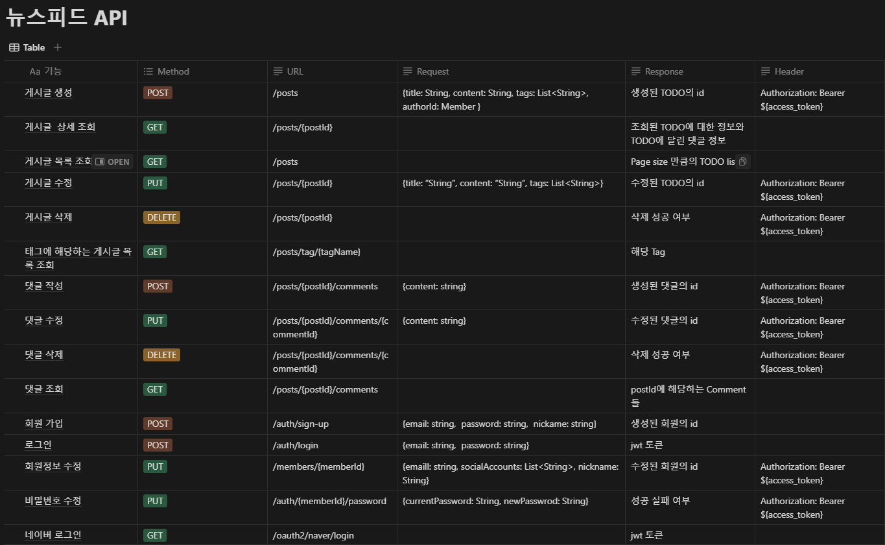

# 뉴스피드 프로젝트

## 🔍 개요

개발자 혹은 개발자 지망생들이 소통을 할 수 있는 커뮤니티형 뉴스피드 API입니다.
개발을 하는 과정에서 직면하게 되는 다양한 상황들은 비슷한 경험을 해보지 못한 사람에게 쉽게 이해될 수 있는 내용이 아닙니다.
그래서 개발자들끼리 서로 이야기를 나누고 공감할 수 있는 커뮤니티 역할을 할 수 있는 뉴스피드를 만들게 되었습니다.
기본적으로 개발 공부를 하며 서로 질문이나 정보를 공유하는 것을 목적으로 하지만 일상과 관련된 내용이어도 괜찮습니다.😊

## 😊 ERD

## 😊 API Specification

https://www.notion.so/cbf9a43296014c5dbfb0b85a7f9dcf76?v=be311eb26548474193ee4a3c43309ccb
http://localhost:8080/swagger-ui/index.html#

## 💻 실행 예시

https://youtu.be/7aZyFnnfp4E?feature=shared

## 📈 과제 요구사항

### 필수 구현 기능(요구사항)

- [x]  **게시물 CRUD 기능**
    - 게시물 작성, 조회, 수정, 삭제 기능
- [x]  **뉴스피드 기능(메인 페이지/전체 조회 페이지)**
    - 뉴스피드 페이지
        - 사용자가 다른 사용자의 게시물을 한 눈에 볼 수 있는 뉴스피드 페이지가 있어야 합니다.
- [x]  **상세보기 기능(디테일 페이지)**
    - 게시글의 상세 페이지
        - 게시글의 내용과 댓글을 볼 수 있는 상세페이지가 있어야 합니다.
- [x]  **댓글 CRUD 기능**
    - 댓글 작성, 조회, 수정, 삭제 기능
        - 사용자는 게시물에 댓글을 작성할 수 있고 본인의 댓글은 수정 및 삭제를 할 수 있어야 합니다.

### 선택 구현 기능

- [x]  **사용자 인증/인가 기능**
    - 회원가입 기능
        - 새로운 사용자가 ID와 비밀번호의 형태로 서비스에 가입할 수 있어야 합니다.
            - 이 때, 비밀번호는 안전하게 암호화되어 저장되어야 합니다!
    - 로그인 및 로그아웃 기능
        - 사용자는 자신의 계정으로 서비스에 로그인하고 로그아웃할 수 있어야 합니다.
            - 로그인 시 토큰을 제공하고 만료 시간은 설정되어있지만 로그아웃은 미구현 상태입니다.
    - 인가 기능
        - 앞서 구현하신 게시물 CRUD 기능에 게시물과 댓글 조회를 제외한 나머지 기능들은 전부 인가(Authorization) 개념이 적용되어야 하며 이는 JWT를 통해.
- [x]  **프로필 관리**
    - 프로필 수정 기능
        - 이름, 한 줄 소개와 같은 기본적인 정보를 볼 수 있어야 하며 수정할 수 있어야 합니다.
        - 비밀번호 수정 시에는 비밀번호를 한 번 더 입력받는 과정이 필요합니다.
- [x]  **소셜 로그인 기능 구현**
    - 네이버 로그인 개발가이드를 참고하여 네이버 로그인을 구현해보세요.

## 환경설정

Language : Kotlin 1.9.24
IDEA : IntelliJ IDEA 2024.1
JDK : temurin 17.0.11  
Database : super base & postgresql  
springframework.boot : 3.3.0
